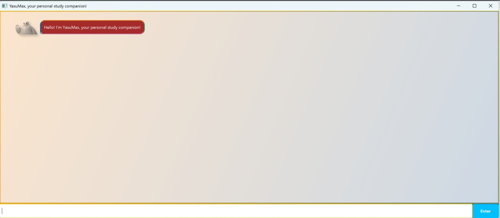
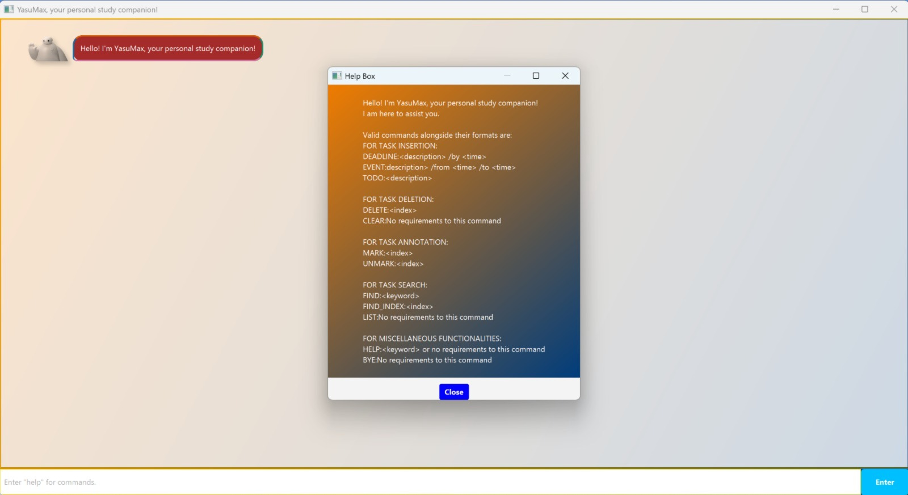
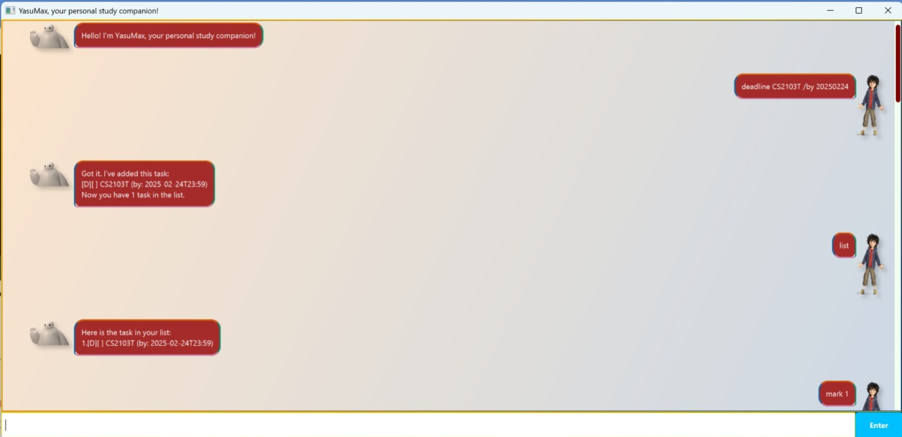
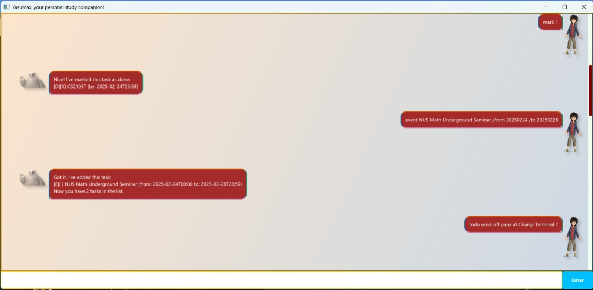
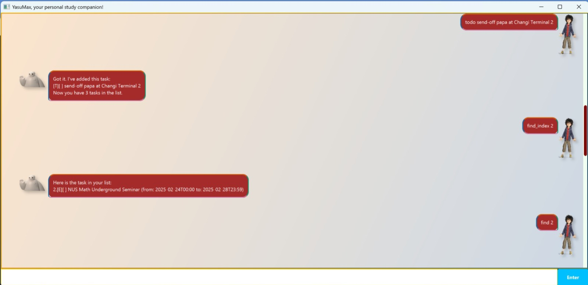
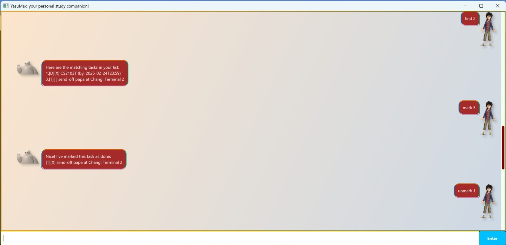
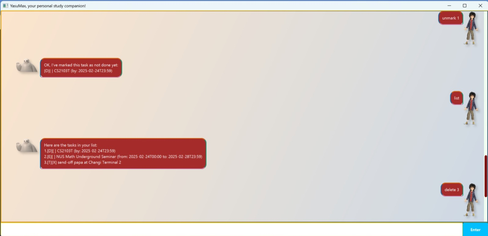
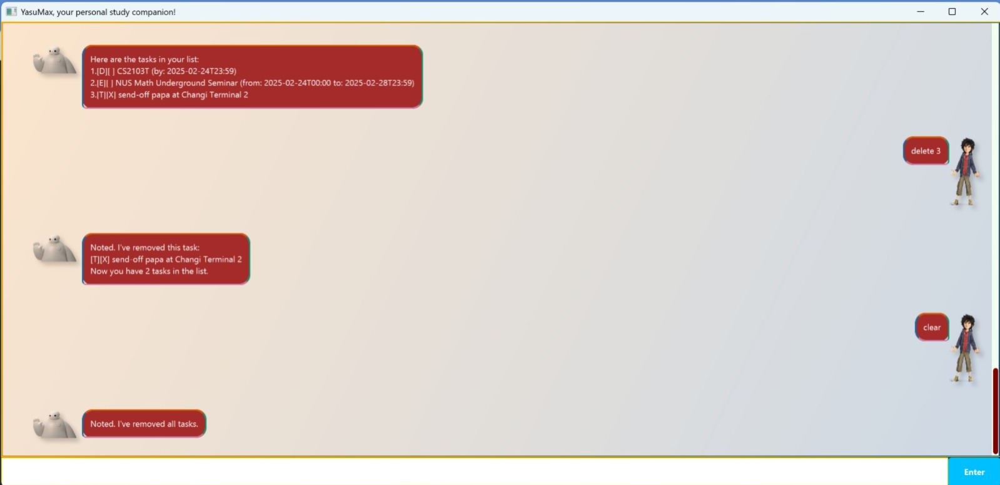

# YasuMax (安Max) - Your Personal Study Companion! 🧑‍🎓👩‍🎓
YasuMax is a user-friendly academic task tracker designed to help students manage their study commitments with ease.<br>
It is optimised for use via a **Command Line Interface** (CLI) while having a nice *Graphical User Interface* (GUI).<br>
Whether you're juggling assignment deadlines in JC, hackathon project TODOs in poly, or your upcoming university FYPs,
YasuMax keeps you on track for a stress-free academic life!

## Why YasuMax? 🤔
"Yasu" means peace in Japanese, and BayMax is the gentle giant (*~awww~*) we all adored in Disney's Big Hero 6 (2014).<br>
When school feels overwhelming and tasks seem endless, we yearn for a reliable companion to assist us.<br>
While BayMax isn't real...YasuMax is! Try it below and call it your dedicated study buddy today!

- Installation Guide
- Quick Demo
- Features
  - Task Insertion
    - Adding a todo task: `todo [description]`
    - Adding a deadline task: `deadline [description] /by [datetime]`
    - Adding an event task: `event [description] /from [datetime] /to [datetime]`
  - Task Deletion
      - Deleting a task by insertion index: `delete [index]`
      - Clearing all tasks: `clear`
  - Task Annotation
      - Marking a task as complete: `mark [index]`
      - Unmarking a task as incomplete: `unmark [index]`
  - Task Search
    - Finding a task by insertion index: `find_index [index]`
    - Finding a task by character(s): `find [keyword]`
    - Listing all tasks: `list`
  - Miscellaneous Features
      - Viewing general help: `help`
      - Viewing specific help: `help [valid_command]`
      - Exiting app: `bye`
- 

## Installation Guide
1. Ensure you have Java `17` or above installed in your Computer.<br>
**Mac users:** Ensure you have the precise JDK version [here](https://se-education.org/guides/tutorials/javaInstallationMac.html).<br>
You can check your Java version on any OS by running in your terminal: `java -version`
2. Navigate to the [YasuMax GitHub Releases](https://github.com/Mingyuan03/ip/releases) page.
3. Download the latest `YasuMax.jar` file to a local home directory of your choice.
4. Run `YasuMax` via this command in your terminal: `java -jar YasuMax.jar`. This should launch YasuMax in GUI mode .

## Quick Demo
1. Type `help` in GUI mode for all available commands alongside their formats. A resizable pop-up window should appear:
   1. Take note that this pop-up window must be closed explicitly to ensure you have read through them thoroughly!
   2. `YasuMax` allows you to further customise your `help` by specifying 1 additional command to get its format! E.g.:
2. Try out the following sample commands in sequence:
   ```
   help help
   deadline CS2103T /by 20250224
   list
   mark 1
   event NUS Math Underground Seminar /from 20250224 /to 2025028
   todo send-off papa at Changi Terminal 2
   find_index 2
   find 2
   mark 3
   unmark 1
   list
   delete 3
   clear
   bye
3. Ensure you get the result for Step 2 as depicted in the 6 images below:
   <b>
   <b>
   <b>
   <b>
   <b>
   <b>
4. You are good to go, captain!


